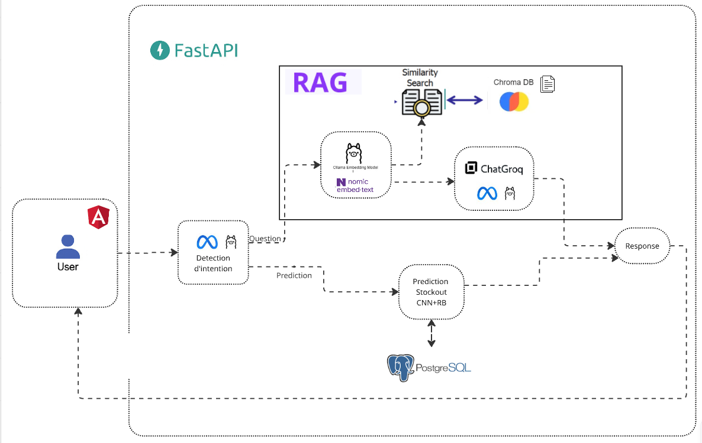

# 🤖 Assistant Approvisionnement - Chatbot avec RAG

Ce projet est un **chatbot intelligent spécialisé dans l’approvisionnement** qui utilise la technologie **RAG (Retrieval-Augmented Generation)** pour fournir des réponses **précises, rapides et contextuelles**, ainsi que pour effectuer des **prédictions de rupture de stock** des produits.

---

## 🏗️ Architecture

<p align="center">
  
</p>

---

## 🔍 Explication de l’Architecture

L’architecture repose sur une **intégration fluide entre FastAPI, Angular et plusieurs modèles d’intelligence artificielle**.  
Le fonctionnement global du système suit **deux flux principaux**, selon la nature de la requête de l’utilisateur.

---

### 🧑‍💻 1. Interaction Utilisateur (Frontend Angular)
L’utilisateur interagit à travers une interface moderne développée avec **Angular** :
- Il peut poser une **question générale** sur les processus d’approvisionnement.  
- Ou bien demander une **prédiction sur la disponibilité d’un produit** (risque de rupture de stock).

Les requêtes sont ensuite transmises au **backend FastAPI** via des appels **API REST** sécurisés.

---

### ⚙️ 2. Traitement des Requêtes (Backend FastAPI)
Le backend joue le rôle de **chef d’orchestre** :
- Il reçoit la requête de l’utilisateur.  
- Analyse son **intention** grâce à un **modèle de langage (LLM)**.  
- Redirige ensuite la requête vers le module approprié :
  - **Module RAG** → pour les questions informationnelles.  
  - **Module de Prédiction CNN + Réseau bayésien** → pour les estimations de rupture de stock.

---

### 🧩 3. Détection d’Intention
Un **modèle LLM (ChatGroq)** — *llama-4-maverick-17b-128e-instruct* — identifie automatiquement la nature de la demande :
- Si la requête contient une intention **informationnelle** (ex. : *« Quels sont les délais d’approvisionnement ? »*),  
  👉 elle est traitée par le **pipeline RAG**.
- Si la requête contient une intention **prédictive** (ex. : *« Le produit X risque-t-il d’être en rupture ? »*),  
  👉 elle est redirigée vers le **module CNN + Réseau bayésien**, après **extraction des caractéristiques du produit** depuis la base de données **PostgreSQL**.

---

### 🧠 4. Module RAG (Retrieval-Augmented Generation)
Pour les **questions générales** :
1. La requête est encodée en **vecteurs** grâce à **Nomic Embed-Text**, via l’**API d’Ollama**.  
2. Une **recherche sémantique** est effectuée dans **ChromaDB**, la base vectorielle.  
3. Le **modèle ChatGroq (LLM)** génère ensuite une **réponse contextuelle**, en combinant les informations retrouvées avec sa compréhension du langage.  
→ Résultat : une réponse **riche, précise et adaptée au contexte**.

---

### 📈 5. Module de Prédiction (CNN + Réseau bayésien)
Pour les **requêtes prédictives** :
1. Le backend interroge les **données de stock** et les **historiques produits** dans **PostgreSQL**.  
2. Le **modèle CNN (Convolutional Neural Network)** extrait les tendances temporelles et saisonnières.  
3. Le **modèle à Réseau bayésien** affine la prédiction finale afin d’améliorer la fiabilité.  
→ Résultat : une estimation précise de la **probabilité de rupture de stock** pour chaque produit (SKU).

---

### 💾 6. Base de Données
| Type | Rôle |
|------|------|
| 🧠 **ChromaDB** | Stocke les embeddings et permet la recherche vectorielle rapide pour le module RAG. |
| 📊 **PostgreSQL** | Contient les données métiers : produits, historiques de stock, ventes, prévisions, etc. |

---

### 🔁 7. Réponse à l’Utilisateur
Une fois le traitement terminé :
- Le **module RAG** ou le **modèle prédictif** renvoie le résultat au **backend**.  
- **FastAPI** formate la réponse et la transmet au **frontend Angular**.  
- L’utilisateur visualise une réponse **claire, dynamique et adaptée à son profil** (spécialiste / non-spécialiste).

---

## ⚙️ Composants

| Composant | Description |
|------------|-------------|
| 🧩 **Backend** | FastAPI (Python) – API REST du chatbot |
| 💻 **Frontend** | Angular – Interface utilisateur moderne |
| 🧠 **IA & RAG** | ChatGroq, Nomic Embed-Text, ChromaDB |
| 📈 **Prédictions** | CNN + Réseau bayésien |
| 🗄️ **Base de données** | PostgreSQL pour les données métiers |

---

## 🚀 Installation et Démarrage

### 🔧 Backend (FastAPI)
```bash
cd backend
pip install -r requirements.txt
python main.py
